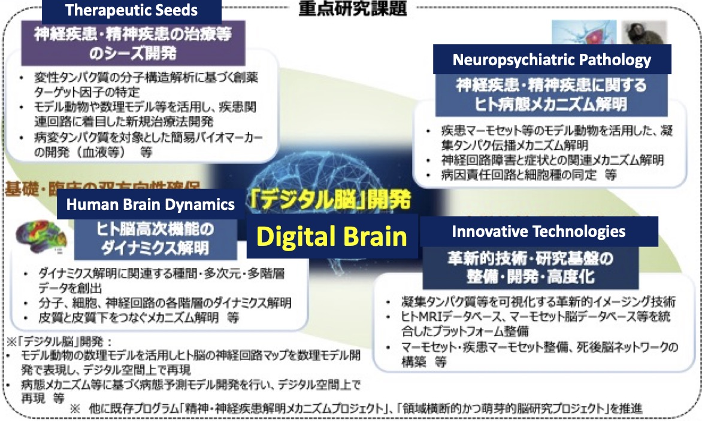

# BM2 Digital Brain Project

Following the conclusion of the Brain/MINDS project (2014-2024), a new six-year program Multidisciplinary Frontier Brain and Neuroscience Discoveries ([Brain/MINDS 2.0](https://brainminds.jp/en)) has started.

A remarkable feature of this program is that the Digital Brain 「デジタル脳」plays a central role in integrating structural and dynamic brain data from multiple species for understanding brain functions and tackling neuropsychiatric disorders.

  
(from [MEXT FY2024 budget request](https://www.mext.go.jp/content/20240118-ope_dev03-000031627-1.pdf) p. 74) 

## Core Organization

RIKEN and seven partner institutions including OIST, ATR and Kyoto University were selected as the [Core Organization](https://brainminds.jp/en/core).

Five PIs form the Digital Brain Group with 6 subprojects.

* Shin Ishii, Kyoto University
* Henrik Skibbe, RIKEN CBS
* Saori Tanaka, ATR
* Kenji Doya, OIST (group head)
* Jun Igarashi, RIKEN AICS
* Takuya Isomura, RIKEN CBS (droup subhead)

## Priority Resarcg Themes

In addition, 97 projects for the priority research themes were accepted, with [16 projects on the Digital Brain](https://brainminds.jp/en/theme4).

* Yuji Ikegaya, University of Tokyo
* Keiichi Kitajo, National Institute of Natural Sciences
* Yasuharu Koike, Institute of Science Tokyo
* Ken Nakae, National Institute of Natural Sciences
* Riichiro Hira, Institute of Science Tokyo
* Tadashi Yamazaki, U Electro-Communications
* Yuichi Yamashita, National Center of Neurology and Psychiatry
* Takuto Okuno, Tokyo Metropolitan University
* Yukiyasu Kamitani, Kyoto University
* Carlos Enrique Gutierrez, OIST
* Zhe Sun, Juntendo University
* Tomohiko Takei, Tamagawa University
* Mari Tada, Niigata University
* Hiromichi Tsukada, Chubu University
* Akihiro Funamizu, University of Tokyo
* Yuichiro Yada, Nagoya University

## Events

To facilitate discussions about how to build and to utilize digital brains, we organize [*Digital Brain Seminars*](https://boatneck-weeder-7b7.notion.site/Digital-Brain-Seminar-90cc94badac64d32a281cba4245ed66d).  

Most of the talks are available on the [YouTube channel](https://www.youtube.com/@kennakae2779).

On September 19-21, 2024, we organized [Digital Brain Workshop](https://boatneck-weeder-7b7.notion.site/Digtal-Brain-Workshop-131a68936dda4867a88fedd25dfaac92) in collaboration with [Institute of Mathematics for Industry, Kyoshu University](https://www.imi.kyushu-u.ac.jp/en/)

## Research positions

[OIST Neural Computation Unit](https://groups.oist.jp/ncu) (prof. Kenji Doya) will take a leading role in developing the software tools for constructing digital brains and their use cases for understanding brain functions, such as reinforcement learning and Bayesian inference, and prediction, intervention, and prevention of neuropsychiatric disorders.

This ambitious project requires fresh talents from math, computation, AI and brain sciences, as well as broad international collaborations. We have postdoc and technical positions available. If you are interested, please apply by this [application form](https://groups.oist.jp/ncu/oist-neural-computation-unit-job-application-form).